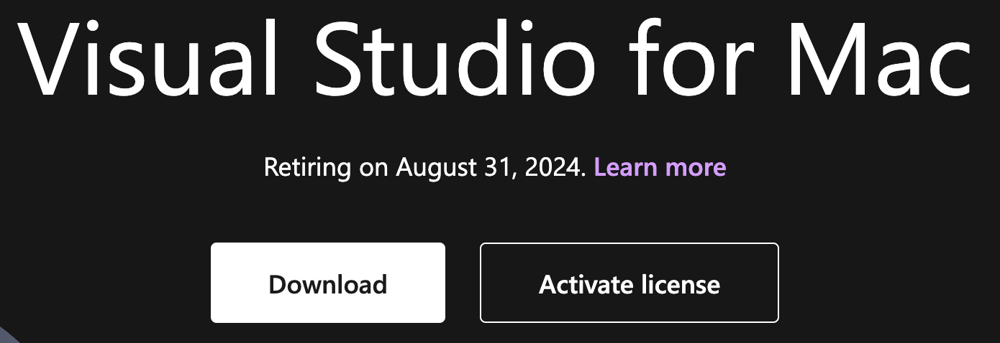
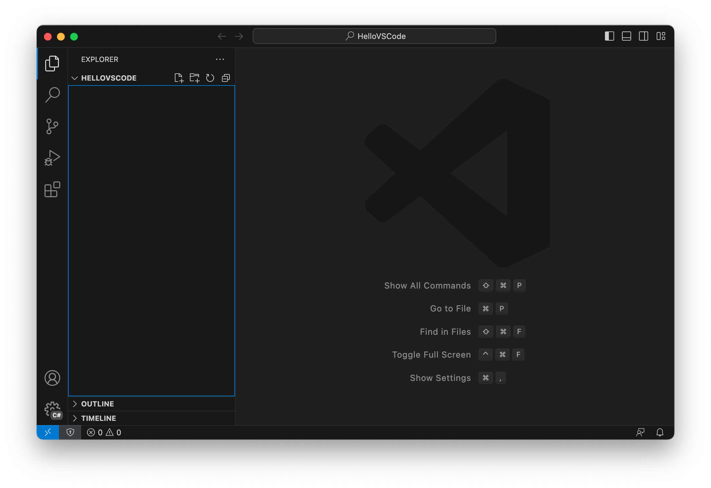
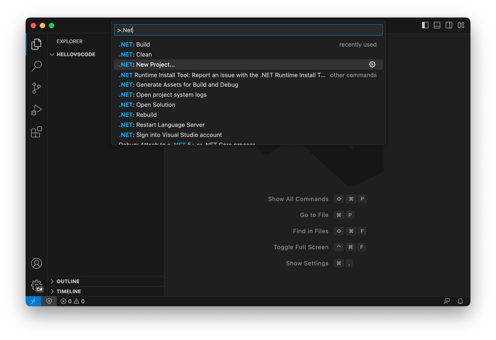
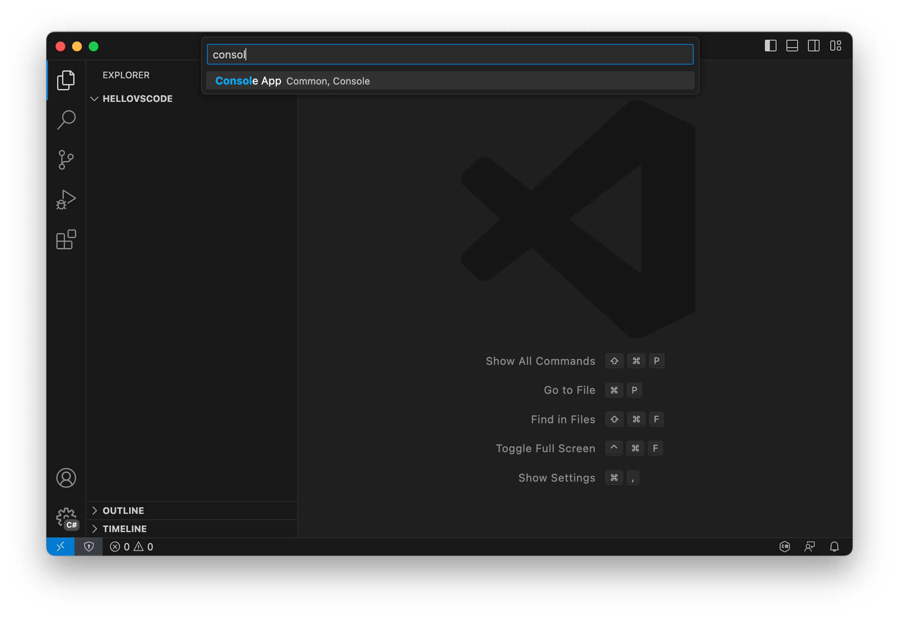
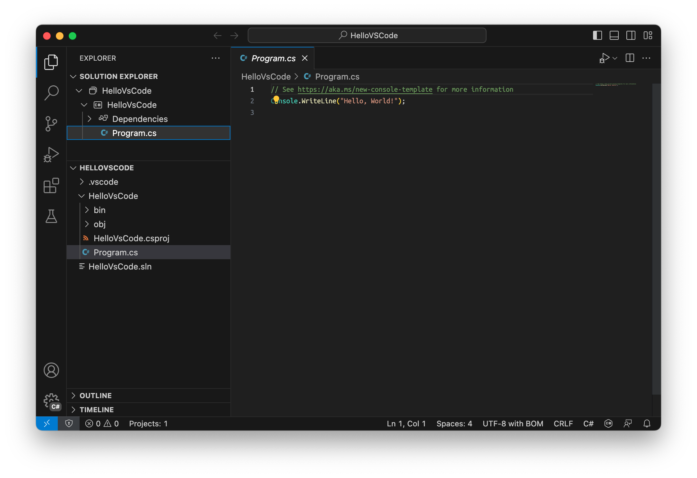
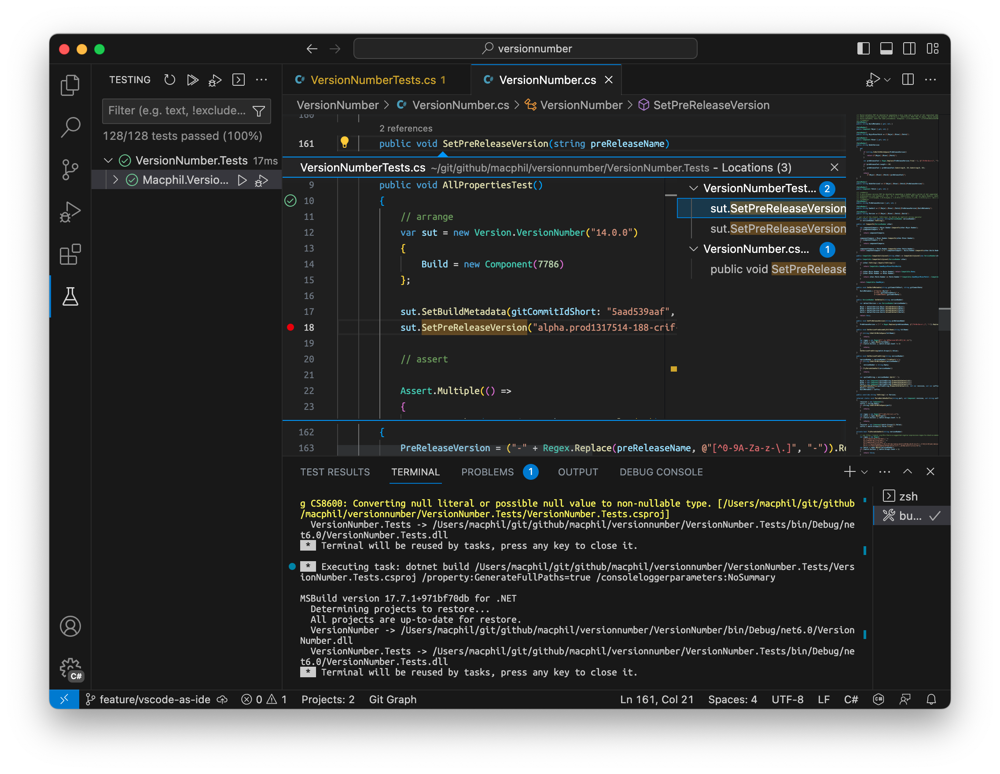
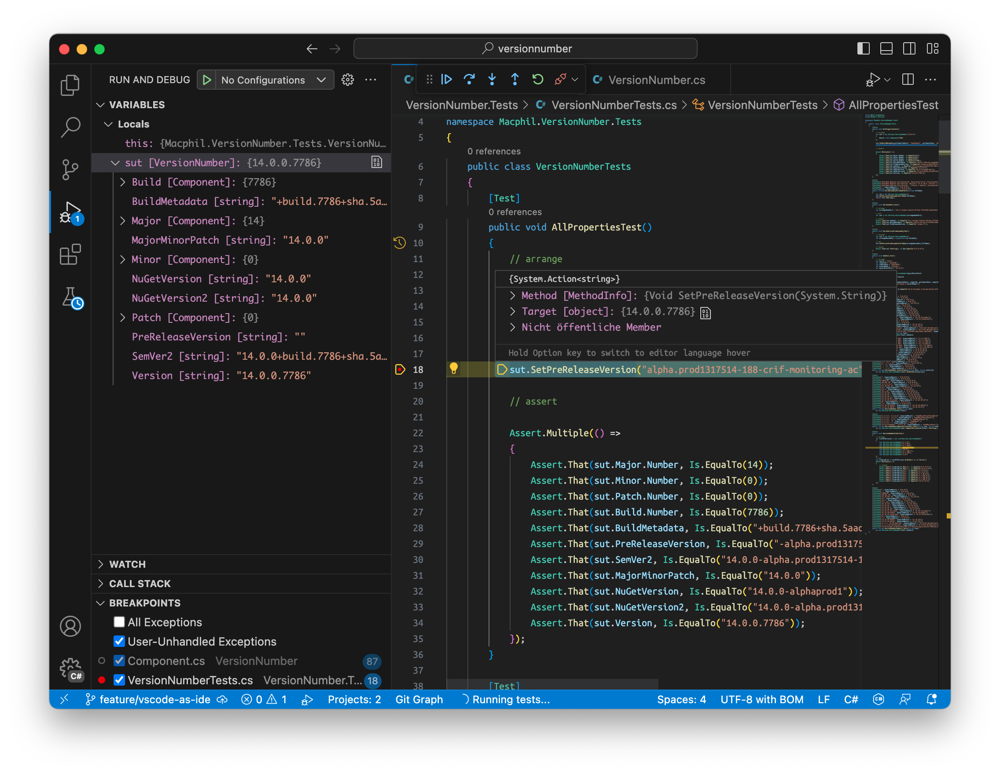

# C# Entwicklung auf einem mac

Wenn man mit der Entwicklung von C# (oder eine andere .NET  - Sprache) anfangen möchte, ist meiner Meinung nach die beste Kombination Windows &  Visual Studio.

Falls nun aus welchen Gründen auch immer kein Windows-System zur  Verügung steht, ist dies seit einiger Zeit auch kein KO-Kriterium mehr, da seit .NET core die Entwicklung nicht mehr an Windows gebunden ist. Es gibt weiterhin Dinge, die nur unter Windows funktionieren, aber dass kann an dieser Stelle ignoriert werden.

## Visual Studio für Mac

Für mac bietet Microsoft zum Entwickeln Visual Studio für Mac an: 

(Screenshot https://visualstudio.microsoft.com/de/vs/mac/ -  04.09.2023)

Englischsprachige Nutzer haben jedoch einen Wissensvorsprung:

(Screenshot https://visualstudio.microsoft.com/vs/mac/ - 04.09.2023)

Der Link führt auf [What's happening to Visual Studio for Mac?](https://learn.microsoft.com/en-us/visualstudio/mac/what-happened-to-vs-for-mac?view=vsmac-2022)

Dort wird dann erklärt, dass Microsoft den Editor nicht mehr weiterentwickelt wird und nach dem 31.09.2024 auch nicht mehr verfügbar ist.:

> **On or before Aug 31, 2024**
>
> - […] Microsoft doesn't plan to add support for [.NET 8](https://learn.microsoft.com/en-us/dotnet/core/whats-new/dotnet-8/) or [C#12](https://learn.microsoft.com/en-us/dotnet/csharp/whats-new/csharp-12/) to Visual Studio for Mac. We won't extend to any other workloads before retirement either.
>
> **After Aug 31, 2024**
>
> Visual Studio for Mac is no longer be supported or maintained starting August 31st, 2024. Starting that date, Visual Studio for Mac remains available as a legacy installation only via my.visualstudio.com for users with Visual Studio subscriptions.

Als Alternative wird auf [Visual Studio Code](https://code.visualstudio.com/docs/editor/whyvscode) & [C# Dev Kit](https://marketplace.visualstudio.com/items?itemName=ms-dotnettools.csdevkit) verwiesen.

## VS Code & C# Dev Kit

Der open-source editor VS Code von Microsoft ist meiner Meinung nach wirklich gut gelungen und wird von mir selbst auf dem mac seit Jahren als zentrale Entwicklungsumgebung genutzt. 

Jedoch bin ich bisher nicht auf die Idee gekommen, diesen zur C#-Entwicklung zu nutzen, da die bisherigen Erweiterungen dafür eher schlecht als recht funktionieren.

Das ist nun mit [C# Dev Kit](https://marketplace.visualstudio.com/items?itemName=ms-dotnettools.csdevkit) anders geworden.

Folgende Schitte sind Notwendig:

1. [installieren von VS Code](https://code.visualstudio.com/)
2. [installieren des .NET 7.0 SDK für Visual Studio Code](https://dotnet.microsoft.com/en-us/download/dotnet/sdk-for-vs-code?utm_source=vs-code&amp;utm_medium=referral&amp;utm_campaign=sdk-install)
3. [installieren der Erweiterung C# Dev Kit](https://marketplace.visualstudio.com/items?itemName=ms-dotnettools.csdevkit)

## Hello VSCode

1. Erstellen eines leeren Ordners und Öffnen in VSCode:
   

2. Command Palette: `.NET: New Project`
   

3. Command Palette: `Console App`

   

4. Ansicht Explorer und Solution Explorer

   (Hinweis: habe den Solution Explorer nach oben geschoben)

   
   

5. Ausführen

   

6. CodeLense (einer andenen Solution)

7. Debug (einer andenen Solution)

## Fazit

Nach dem ersten Blick auf diese Kombination bin ich als langjähriger Nutzer von Visual Studio unter Windows beeindruckt: Codelense, Debugging, IntelliSense und Testing funktionieren. Einzig die UI ist nicht so überfrachtet wie die von Visual Studio (Windows), was aber gerade für den Anfang garnicht so schlecht ist. Das Kontextmenü bzw die Command Palette (⇧⌘P)  oder F1  übernehmen nun die Aufgabe zu allen relevanten Punkten.

Auf jeden Fall besser als Visual Studio für Mac, dem ich somit keine Träne nachweinen werde.

### Links:

- [Getting Started with C# in VS Code](https://code.visualstudio.com/docs/csharp/get-started)
- [Download .NET](https://dotnet.microsoft.com/en-us/download/dotnet)
