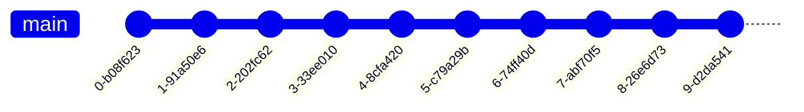

# Git: used branch models / workflows

## Preface

**from where should a branch be created?**
Most git users are only concerned with the question of which branch they should create the branch for a new feature from and merge it back in via a pull request.
The answer is usually like this:

- for an new feature: `develop` (or - **and only then** - if there is no develop, `main`)
- merge back into that branch where you branched from

The details become exciting when it comes to hotfixes (= bug fixes in several versions) and the release process.

General rules for products - regardless of the chosen workflow:

- the main - branch is protected
- each delivered version must be provided with a unique version
- merge requires a pull request with reviewer and passed review
- no change without JIRA story
  - the key of the story SHOULD precede each commit
  - the branch name MUST be identifiable with the story
- if the target branch has changed, rather rebase than merging
- be careful when rewriting the story for a remote branch (e.g. rebase): Make sure you are the only one affected by the changes
- Squashing commits only if you have done a lot of local "work in progress" commits

# Git flow (preferred)

The standard git workflow.

The daily work takes place at an dedicated feature branch, witch must be forked from develop and must be merged via pull-request back to develop.

The following Branches may exist in our git-workflow:

- `feature/*` - Branch = Branch, where the implementation actually happens
- `develop` - Branch = finished changes for the next release
- `release/*` - Branch, where release-preparation will take place (finish release documentation etc.)
- `main` - Branch = productive-like code

**Release - hints:**

1. creating the release branch from `main` and them merge `develop` into the release branch ensures, that problems occur at the beginning of the release phase and not at the end when the merge into the main takes place
2. don’t forget to bump the version number when creating an release/support/hotfix - branch

# Other workflows

## GitHub flow

[GitHub flow - GitHub Docs](https://docs.github.com/en/get-started/quickstart/github-flow)

The GitHub Flow is a lightweight workflow. It was created by [GitHub in 2011](http://scottchacon.com/2011/08/31/github-flow.html) and respects the following 6 principles:

1. Anything in the `main` branch is deployable
2. To work on something new, create a branch off from`main` and given a descriptively name(ie: `new-oauth2-scopes`)
3. Commit to that branch locally and regularly push your work to the same named branch on the server
4. When you need feedback or help, or you think the branch is ready for merging, open a [pull request](http://help.github.com/send-pull-requests/)
5. After someone else has reviewed and signed off on the feature, you can merge it into `main`
6. Once it is merged and pushed to `main`, you can and *should* deploy immediately

[Introduction (trunkbaseddevelopment.com)](https://trunkbaseddevelopment.com/)

## No-branch “flow” (must not used productive)

 
Links:

- [War of the Git Flows - DEV Community](https://dev.to/scottshipp/war-of-the-git-flows-3ec2)
- [Gitgraph (Git) Diagram 🔥 (mermaid-js.github.io)](https://mermaid-js.github.io/mermaid/#/gitgraph)
