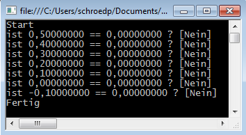

# :de: Codeperlen

## Vergleich von Fließkommazahlen auf einen exakten Wert

Früher™, als ich Informatik gelernt habe, wurde extrem viel Wert auf Speicherplatz gelegt, was nebenbei mir ermöglichte, ansatzweise zu verstehen, was genau passiert, wenn z.B. eine Fließkommazahl abgespeichert wird.

So hat sich bei mir eingebrannt, dass  ich **niemals** eine **Fließkommazahl** mit einer mit einem anderen Wert **auf Gleicheit testen** darf.

Deshalb rollen sich bei mir die Zehennägel, wenn ich sowas lese (`umsatz` und `bruttonutzen` sind beides vom Typ `double`):

```c#
if (umsatz == 0)
{
    numericValue = bruttonutzen == 0 ? "0.00" : string.Empty;
}
```

Ich gebe ehrlich zu, dass ich nicht nicht ausschließen möchte, dass es hinreichend oft funktioniert, aber der R#-Vorschlag deckt sich mit dem, was ich in Erinnerung habe (nämlich, dass man Fließkommazahlen immer auf Ungleichheit testen muss, wobei ungleich aus naheliegenden Grünen auch nicht wirklich empfehlenswert ist :wink:

```
 private const double Genauigkeit = 0.001;
 if (Math.Abs(umsatz - 0) < Genauigkeit)
 {
     numericValue = Math.Abs(bruttonutzen - 0) < Genauigkeit ? "0.00" : string.Empty;
 }
```

 

Als Beweis, dass es sich keineswegs um theoretische Spinnereien handelt, folgendes Beispiel (**darf gerne selbst ausprobiert werden**):

### double ungenau

```c#
public static void Main(string[] args)
{
    Console.WriteLine("Start");
    const double DoubleZero = 0d;
    for (double d = 0.5; d > -0.1; d = d - 0.1)
    {
        Console.Write("ist {0:F8} == {1:F8} ? ", d, DoubleZero);
        Console.WriteLine(d == DoubleZero ? "[JA]" : "[Nein]");
    }
    Console.WriteLine("Fertig");
    Console.ReadLine(););
}
```

Man könnte erwarten, dass die 0 getroffen wird. Tut es aber nicht:



Falls jemand Interesse an weiterführenden Infos dazu haben möchte: der[Wikipedia-Artikel zu IEEE 754](https://de.wikipedia.org/wiki/IEEE_754) ist ein guter Einstieg :smile:

Und wem Wikipedia zu »unseriös« ist uns stattdessen auf Microsoft schwört: Hier ein Artikel in der [MSDN zum Thema »Rundungsfehler beim Umwandeln von Fließkommawerten in Ganzzahlwerte«](https://msdn.microsoft.com/de-de/library/bb978923.aspx) (dort kommt erschwerend hinzu, dass manche alten Prozessoren eine fehlerhafte Logik hatten)


## Spaß mit Datenstrukturen...

Folgender Code sah für mich nach einer validen Lösung aus:

```c#
IEnumerable<Principal> found = [...]
Console.WriteLine($"found {found.Count()} principals");
int i = 0;
foreach (GroupPrincipal group in found)
{
    Console.WriteLine($"process [{++i}/{found.Count()}]");
}
Console.WriteLine("finish!");
```

Die Ausführung hat mich dann aber doch ein wenig überrascht:

```
found 101 principals
process [1/101]
finish!
```

Was ist passiert :question: :disappointed:

Der Aufruf von **`.count()`** auf einem **`IEnumerable<>`** verschiebt den internen Pointer auf das letzte Element...

Um dies zu umgehen kann z.B.

- der count vorher ermittelt und in eine Variable abgelegt werden
- statt eines IEnumerables eine `**List<>**` verwendet werden:

```c#
List<Principal> found = [...].ToList();
Console.WriteLine($"found {found.Count()} principals");
int i = 0;
foreach (GroupPrincipal group in found)
{
    Console.WriteLine($"process [{++i}/{found.Count()}]");
}
Console.WriteLine("finish!");
```

```c#
found 101 principals
process [1/101]
process [2/101]
...
process [100/101]
process [101/101]
finish!
```

=> kaum macht man es richtig … :smile_cat: