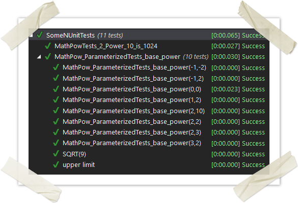
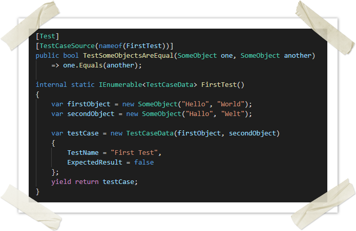

# :de: NUnit - best practices

## allgemeine Empfehlungen

- Sprechende Namen nach dem Muster `<Klasse unter Test>_<Testfall>_<erwartetes Ergebnis>`
- Verwendung des AAA - Patterns (es hilft **wirklich**, wenn man dies sogar hinschreibt)
- Möglicht wenig Logik im Test

```c#
using NUnit.Framework;
  
[TestFixture]
public class SomeNUnitTests
{
    [Test]
    public void MathPowTests_2_Power_10_is_1024()
    {
        // arrange
        var arrangedBase = 2;
        var arrangedPower = 10;
  
        // act
        var result = System.Math.Pow(arrangedBase, arrangedPower);
  
        // assert
        Assert.That(result, Is.Not.Null);
        Assert.That(result, Is.Not.Negative);
        Assert.That(result, Is.EqualTo(1024));
    }
}
```

### Sprachabhängige Tests

Falls auf Texte hin geprüft wird, welche lokalisiert werden, muss der Test mittels [SetCulture-Attribute](https://github.com/nunit/docs/wiki/SetCulture-Attribute) die Sprache festgelegt werden.

#### Culture vs. SetCulture

Das **Culture**-Attribut dient als Bedingung, d.H. beim Ausführen auf einer Umgebung mit andere Culture wird der Test ignoriert:

> ignore reason: Only supported under culture de

Nur dort ist dann die Verwendung der neutralen Culture wie "de" möglich.

Beispiel:

```c#
[Test]
[TestCase(2020, 12, 31, ExpectedResult = "12/31/2020")]
[Culture("en")]
public string LocalizedDate(int year, int month, int day)
  => $"{new DateTime(year, month, day):d}";
```

Damit der Test in einer anderen Culture ausgeführt wird, muss **SetCulture** verwendet werden (unter Verwendung der konkreten Culture)

| Attribut                | Testausführung auf Testumgebung mit `de-DE`         | `en-GB`                                              | `en-US`            |
| :---------------------- | :-------------------------------------------------- | :--------------------------------------------------- | ------------------ |
| `[Culture("en")]`       | `Only supported under culture en`                   | `Expected: "12/31/2020" But was: "31/12/2020"` |:white_check_mark:|
|`[SetCulture("en-GB")]`  | :x: `Expected: "12/31/2020" But was: "31/12/2020"` |:x:|:x:|
| `[SetCulture("en-US")]` | :white_check_mark:                                  | :white_check_mark: | :white_check_mark: |

Selbiges gilt natürlich auch für das [SetUiCulture-Attribute](https://github.com/nunit/docs/wiki/SetUiCulture-Attribute)

```c#
[Test]
[SetCulture("de-DE")]
public void GetAdditionalInformation_FilledOriginalResponse_ReturnsMappedResponseInGerman()
{
    // Arrange
    var command = new GetCreditLimitDecisionCompanyCommand
    {
        DebtorId = _debtorId
    };
    // Act
    var response = _sut.Handle(command);
    // Assert
    [...]
    Assert.That(response.Company.CountryCode.LocalizedName, Is.EqualTo("Deutschland"));
    [...]
    Assert.AreEqual("HRN deutsche Lokalisierung", [...].Identifier == "HRN_DEU").Key?.LocalizedName);
    Assert.AreEqual("VAT deutsche Lokalisierung", [...].Identifier == "VAT_DEU").Key?.LocalizedName);
}
```

### mehrere Assertions in einem Test

Wenn mehrere Assertions in einem TestCase vorhanden sind, wird nach dem ersten fehlgeschlagenen Assert der Test beendet (Ausnahme: <https://github.com/nunit/docs/wiki/Multiple-Asserts>). Daher ist die Reihenfolge wichtig. (siehe weiter unten)

## parametrisierte Tests

```c#
using System;
using NUnit.Framework;
  
[TestFixture]
public class SomeNUnitTests
{
    [Test]
    [TestCase(0, 0, ExpectedResult = 1)]
    [TestCase(1, 2, ExpectedResult = 1)]
    [TestCase(2, 2, ExpectedResult = 4)]
    [TestCase(2, 3, ExpectedResult = 8)]
    [TestCase(3, 2, ExpectedResult = 9)]
    [TestCase(9, 0.5d, ExpectedResult = 3, TestName = "SQRT(9)")]
    [TestCase(2, 10, ExpectedResult = 1024)]
    [TestCase(-1, 2, ExpectedResult = 1)]
    [TestCase(-1, -2, ExpectedResult = 1)]
    [TestCase(Double.MaxValue, Double.MaxValue, ExpectedResult = Double.PositiveInfinity, TestName = "upper limit")]
    public double MathPow_ParameterizedTests_base_power(double arrangedBase, double arrangedPower) =>
        Math.Pow(arrangedBase, arrangedPower);
}
```

- schnell viele Tests ohne großen Aufwand
- Grenzwerte leicht abprüfbar
- wenn kein `TestName` angegeben wurde, werden im TestExplorer die konkreten Werte angezeigt:



> Verwendung von TestName
>
> Die Verwendung eines TestNamens ist nur dann sinnvoll, wenn die eigentlichen Parameter des Tests nicht Aussagekräftig genug sind, da sonst die Gefahr besteht, dass Testname und Testcase nicht zueinander passen.

### parametrisierte Tests mit TestCaseData

Parametrisierte Tests per TestCase() funktionieren nur mit primitiven Typen.

Wenn komplexere Objekte für die Tests benötigt werden, müssen diese als Enumeration von [TestCaseData](https://github.com/nunit/docs/wiki/TestCaseData) bereitgestellt werden:



```c#
using System.Collections.Generic;
using System.Linq;
using NUnit.Framework;
public class SomeObjectTestsWithTestCaseData
{
    [Test]
    [TestCaseSource(nameof(SomeObjectsAreEqualTestCases))]
    public bool SomeObjectsAreEqual(SomeObject one, SomeObject another)
        => TestSomeObjectsAreEqual(one, another);
  
    [Test]
    [TestCaseSource(nameof(SomeObjectsAreNotEqualTestCases))]
    public bool SomeObjectsAreNotEqual(SomeObject one, SomeObject another)
        => TestSomeObjectsAreEqual(one, another);
 
    // -- Testcase, der von beiden [Test] aufgefufen wird
    internal bool TestSomeObjectsAreEqual(SomeObject one, SomeObject another)   => one.Equals(another);
  
   // -- TestCaseSource pro ExpectedResult
    internal static IEnumerable<TestCaseData> SomeObjectsAreEqualTestCases()      => TestCases().Where(x => (bool) x.ExpectedResult);
    internal static IEnumerable<TestCaseData> SomeObjectsAreNotEqualTestCases()   => TestCases().Where(x => !(bool)x.ExpectedResult);
 
    // -- Testcases für alle Erwartungen
    internal static IEnumerable<TestCaseData> TestCases()
    {
        yield return new TestCaseData(new SomeObject("Hello", "World"), new SomeObject("Hallo", "Welt")).Returns(false);
        yield return new TestCaseData(new SomeObject("Hello", "World"), new SomeObject("Hello", "World")).Returns(true);
        yield return new TestCaseData(new SomeObject(), new SomeObject()).Returns(true);
        yield return new TestCaseData(new SomeObject(), new SomeObject(null, string.Empty)).Returns(false);
    }
}
```

## AssertSyntax

NUnit bietet mehrere Arten an, wie man Asserts schreibt. Diese können nebeneinander verwendet werden, was jedoch nicht immer zur Übersichtlichkeit beiträgt :smile:

### Klassische Syntax

`Assert.AreEqual(foo, bar);`

> Was mich bei der klassischen Syntax stört, dass mir nicht sofort klar ist, an welcher Stelle nun der erwartete Wert und an welcher Stelle der tatsächliche Wert hin kommt. Das ist im Fehlerfalle schon relevant, denn bei der Meldung sollte man sich sicher sein, ob man den falschen wert erwartet oder den falschen Wert geliefert hat:
>
> ```c#
>   Expected: 10
>   But was:  100
> ```
>
> Korrekt ist übrigens
>
> `Assert.AreEqual(expected, actual);`

### Constraint oder Fluent Syntax

`Assert.That(actual, Is.EqualTo(expected));`

Die Stärke dieser Schreibweise ist, dass viele Bedingungen lesbarer sind.

```c#
using System;
using System.Collections.Generic;
using System.Linq;
  
using NUnit.Framework;
  
[TestFixture]
public class SomeNUnitTests
{
    [Test]
    public void FluentAssertions()
    {
        // arrange
        var dus = new KeyValuePair<int, string>(40474, "Düsseldorf");
        var muc = new KeyValuePair<int, string>(81249, "München");
        var mdf = new KeyValuePair<int, string>(84453, "Mühldorf a. Inn");
        var arrangedZipNumbers = new List<KeyValuePair<int, string>>();
  
        // act
        arrangedZipNumbers.Add(dus);
        arrangedZipNumbers.Add(muc);
        arrangedZipNumbers.Add(mdf);
  
        // assert
        Assert.That(arrangedZipNumbers, Is.Not.Null);
        Assert.That(arrangedZipNumbers, Is.Not.Empty);
        Assert.That(arrangedZipNumbers, Is.Not.Null.And.Not.Empty);
        Assert.That(arrangedZipNumbers, Is.Unique);
        Assert.That(arrangedZipNumbers, Is.TypeOf<List<KeyValuePair<int, string>>>());
        Assert.That(arrangedZipNumbers, Has.Count.AtLeast(1));
        Assert.That(arrangedZipNumbers, Has.Count.EqualTo(3));
        Assert.That(arrangedZipNumbers, Has.Member(dus));
        Assert.That(arrangedZipNumbers.Select(x => x.Value), Has.One.StartWith("Dü"));
        Assert.That(arrangedZipNumbers.Select(x => x.Value), Has.All.Contains("ü"));
        Assert.That(arrangedZipNumbers.Select(x => x.Value), Has.None.Contains("u"));
        Assert.That(arrangedZipNumbers.Select(x => x.Key), Has.Some.LessThan(80000));
        Assert.That(arrangedZipNumbers.Select(x => x.Key), Has.All.GreaterThan(40000));
        Assert.That(arrangedZipNumbers.Select(x => x.Key), Has.All.LessThan(85000));
        Assert.That(arrangedZipNumbers.Select(x => x.Key), Has.Exactly(2).EqualTo(82000).Within(3000));
    }
}
```

#### IsTrue ?!?

Nach Möglichkeit sollte wirklich das `actual` geprüft werden und **nicht** in eine Bedingung eingeschlossen werden, welche dann mit IsTrue geprüft wird.

Beispiele:

- `Assert.That(7 == 7, Is.True);`
   besser:
- `Assert.That(7, Is.GreaterThanOrEqualTo(7));`
  oder
- `Assert.That(7, Is.AtLeast(7));`

 Weitere Constraints:

- `Assert.That(null, Is.Null);`
- `Assert.That("Make it right", Does.StartWith("Make"));`

 Mehr vom Hersteller unter <https://github.com/nunit/docs/wiki/Constraints>

 ```c#
 //-- einfach, aber eigentlich nicht dass, was geprüft werden soll
 Assert.That(developers.All(x => x.ListOfCrime == null), Is.True);
 
 //-- besser, den geprüft wird, dass die Liste null ist
 Assert.That(developers.Select(x => x.ListOfCrime), Is.All.Null);
 
 //-- Beispiel, wo Is.True sinnvoll ist
 Assert.That(developer.IsCompetent, Is.True);
 ```
