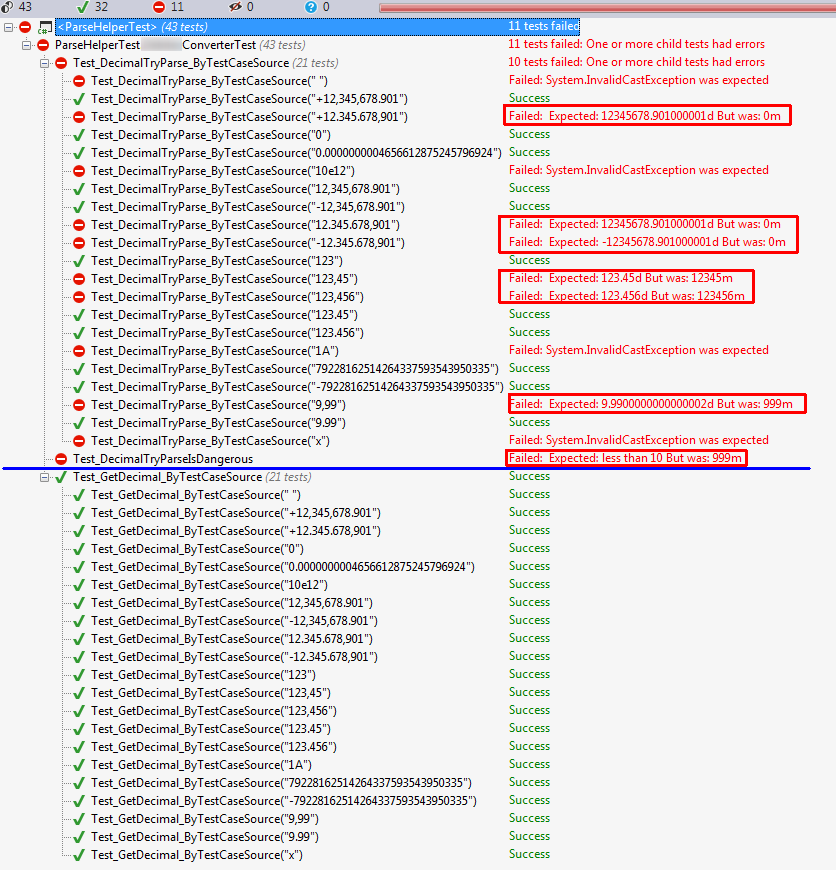

# :de: Als Text vorliegende Werte in eine Zahl parsen

… sollte doch eigentlich möglich sein, oder?

## Vorwort

Jedem Entwickler sollte bewusst sein, dass ein Computer zwar sehr schnell ist, aber dafür ziemlich Dumm ist: er kann noch nicht mal bis zwei Zählen.
Diese an sich triviale Erkenntnis ist umso schmerzhafter, desto selbstverständlicher etwas für uns ist.

## Problemstellung

Wir haben einen Wert als Text vorliegen, da der Datenlieferant leider Werte als String (statt z.B. als [xs:decimal](http://www.w3.org/TR/xmlschema-2/#decimal)) liefert.
Deshalb müssen wir davon ausgehen, dass entweder 1.999,99 oder 1,999.99 kommen kann; in beiden Fällen ist der Wert knapp zweitausend.

## Vermeintliche Lösung :cloud_with_lightning:

klassisch verwenden wir **`decimal.TryParse()`**, zusammen mit der **`CultureInfo.InvariantCulture`**, da irgendwann irgendwer der Meinung war, dass dies klappt.
Und es stimmt ja auch: Wenn Quell-und Zielsysteme sowohl beim Erstellen (**`decimal.ToString()`**) als auch beim Parsen diese **CultureInfo.InvariantCulture** verwenden, dann passt alles.
Leider können wir nicht davon ausgehen.

Und nun kommt es Dicke: die Methode heißt ja »**Try**«, d.H. es wird **versucht** auf biegen und brechen, diesen Text als Zahl zu verstehen. Und wenn da ein paar Zeichen nicht reinpassen, **lässt er diese** halt **weg** und **wirft** leider **keine Fehlermeldung, noch gibt er false zurück!**

Das führt dazu, dass aus "9,99" dann 999 werden --> ein Fehler um den Faktor hundert (und es gibt ja auch Werte mit noch mehr Nachkommastellen....)

Glaubt ihr nicht?

### TryParse ist Boese - UnitTest

```c#
using System.Globalization;
using NUnit.Framework;
public class TryParseIstBoese
{
    [Test]
    public void Test_DecimalTryParseIsDangerous()
    {
        // arrange
        const string NeunKommaNeunundneunzig = "9,99";
        decimal convertedDecimal;
        // act           
        decimal.TryParse(NeunKommaNeunundneunzig, NumberStyles.Number, CultureInfo.InvariantCulture, out convertedDecimal);
        //assert
        Assert.That(convertedDecimal, Is.LessThan(10));
    }
}
```

## Und nun?

Eine Helperklasse, welche die meisten Fälle abdecken sollte. Hier schon mal mein UnitTestReport:
Oben zum Vergleich das Ergebnis beim Verwenden von  **`decimal.TryParse(textToParse, NumberStyles.Number, CultureInfo.InvariantCulture, out convertedDecimal)`**



Die Idee dahinter ist zu schauen, ob und wenn ja, wo Punkt und Komma verwendet werden.

Im Pseudocode:
Wenn es kein Komma gibt aber einen Punkt oder erst Komma und als letztes Punkt,
--> dann ist der Punkt das Dezimaltrennzeichen,
--> ansonsten (kein Komma oder Punkt oder als letztes ein Komma) ist das Komma das Dezimaltrennzeichen.

In die einzige mir bekannte Lücke ist die, wenn eine Zahl nur mit einem Tausendertrennzeichen kommt, also wenn 123,456 oder 123.456 nicht knapp über 123 sein soll, sondern über Einhundertausend; jedoch gehe ich davon aus, dass die Tausenderzrennzeichen selten ohne Dezimalztennzeichen genutzt werden :smiley:


### Vorschlag zum Konvertieren von Text in Zahl

> **warning** 
>
> **Unter der Annahme, dass Tausendertrennzeichen nicht ohne Dezimalternnzeichen vorkommen**

```c#
public static decimal GetDecimal(string value)
{
    if (string.IsNullOrWhiteSpace(value))
    {
        throw new InvalidCastException(string.Format("Value is null or whitespace"));
    }
    const string Comma = ",";
    const string Dot = ".";
    decimal amount;
    NumberFormatInfo debitexFormat = new NumberFormatInfo();
    debitexFormat.NumberDecimalDigits = 2;
    int indexOfComma = value.IndexOf(Comma, StringComparison.Ordinal);
    int lastIndexOfDot = value.LastIndexOf(Dot, StringComparison.Ordinal);
    if (indexOfComma < lastIndexOfDot)
    {
        debitexFormat.NumberDecimalSeparator = Dot;
        debitexFormat.NumberGroupSeparator = Comma;
    }
    else
    {
        debitexFormat.NumberDecimalSeparator = Comma;
        debitexFormat.NumberGroupSeparator = Dot;
    }
    if (decimal.TryParse(value, NumberStyles.Number, debitexFormat, out amount))
    {
        return amount;
    }
    throw new InvalidCastException(string.Format("NumberFormat of '{0}' not recognized", value));
}
```
